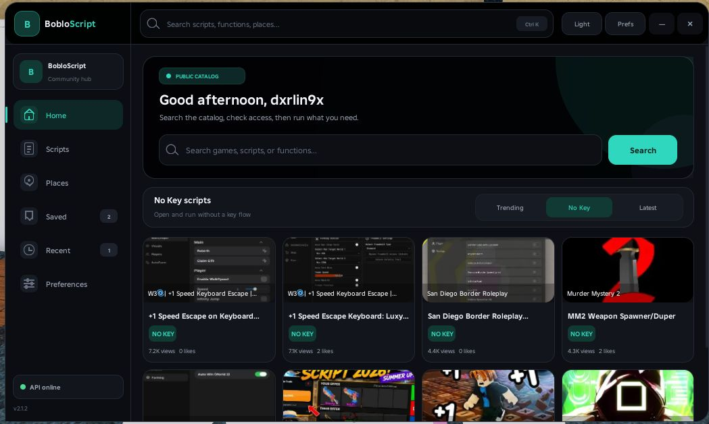
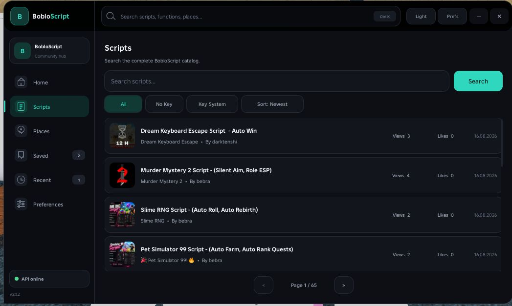
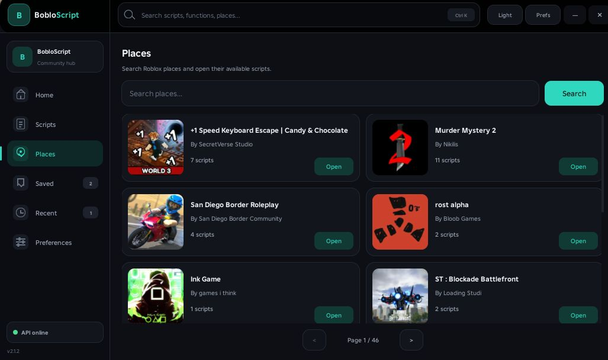
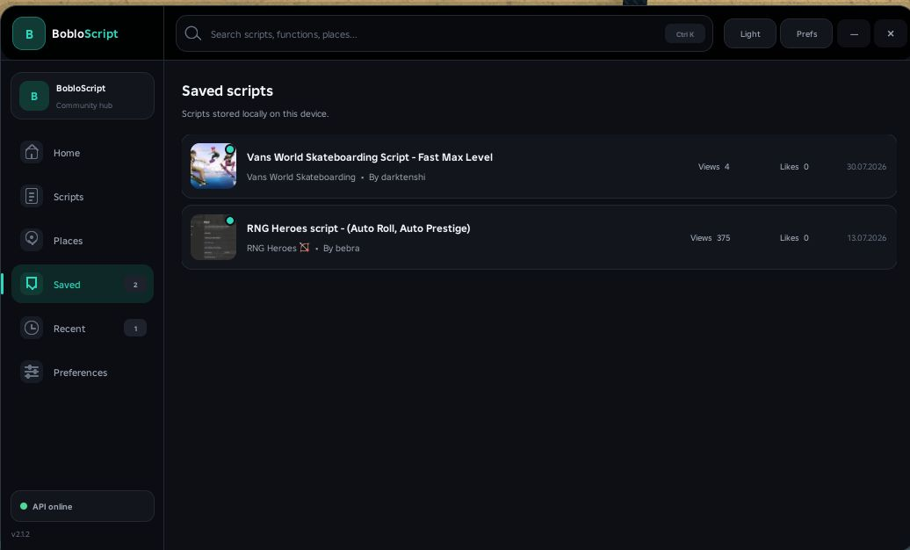
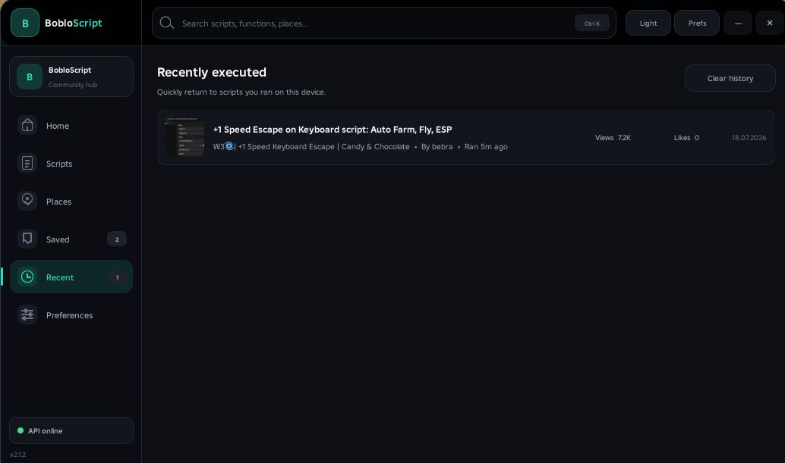
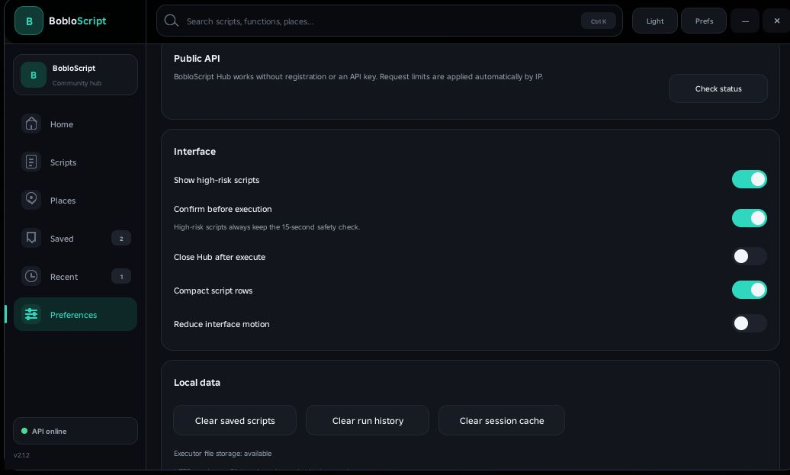

<div align="center">

# BobloScript Hub

**Search and run Roblox scripts from inside your executor.**
No registration, no API key, no key system on the Hub itself.

[](https://github.com/bobloscript/bobloscript-Hub/commits)
[](LICENSE)
[](https://bobloscript.com)

[Catalog](https://bobloscript.com/hub) · [API docs](docs/API.md) · [Discord](https://discord.gg/WZMTeKNEbT) · [Telegram](https://t.me/roblox_scripts)

</div>



---

## Quick start

```lua
loadstring(game:HttpGet("https://bobloscript.com/hub/bobloscript-hub.lua"))()
```

1. Copy the line above.
2. Paste it into a compatible Roblox executor and press Execute.
3. The Hub window opens — search a game or a script, open it, run it.

> [!WARNING]
> Scripts in the catalog are submitted by community members. BobloScript does not guarantee that any script is safe. High-risk scripts show an extra warning and a mandatory wait before execution — read what you are running.

---

## What's in this repository

This repo holds the **source of the loader** shown above, so you can read exactly what that one line does before you run it. It is a mirror of the file served from `bobloscript.com/hub/bobloscript-hub.lua`.

Scripts themselves are **not** hosted here. They are fetched from the public API at runtime, which means a broken script can be fixed or pulled without anyone re-copying the loader.

---

## Features

| | |
|---|---|
| **Search** | Full catalog search by game, script, or function |
| **Places** | Browse by Roblox game with per-place script counts |
| **Access filters** | No Key / Key System, sortable by newest, updated, views, or trending |
| **Saved** | Bookmark scripts locally on the device |
| **Recent** | History of what you ran, with a quick re-run |
| **Safety checks** | Confirm-before-execute, 15-second wait on high-risk scripts |
| **Preferences** | Light/dark theme, compact rows, reduced motion, clear local data |

---

<details>
<summary><b>Screenshots</b></summary>

### Home


### Script catalog


### Places


### Saved and recent



### Preferences


</details>

---

## Compatible executors

**Windows** — Solara, Xeno, Wave, Cryptic, Synapse Z, AWP.GG
**Android** — Delta, Codex, Cryptic, Trigon Evo, Illusion
**macOS** — Macsploit
**iOS** — Delta iOS

> [!TIP]
> Script not running at all? Check whether your executor still works after the latest Roblox patch before reporting it broken: [executor status](https://bobloscript.com/executors)

<!-- Проверьте URL страницы статуса — здесь должен стоять реальный адрес. -->

---

## Public API

The catalog behind the Hub is open. No registration, no API key — rate limits are applied per IP.

```bash
curl "https://bobloscript.com/v1/search?q=blox+fruits"
```

Build your own hub, a Discord bot, or a status page on top of it: **[full API reference →](docs/API.md)**

---

## Publish your scripts

BobloScript is community-driven. Publishing gives you a public profile, view and like counts, and readers who follow your releases.

→ [Publish a script](https://bobloscript.com/publish)

---

## Links

- Website — https://bobloscript.com
- Discord — https://discord.gg/WZMTeKNEbT
- Telegram — https://t.me/roblox_scripts

---

## License

[MIT](LICENSE) — applies to the loader source in this repository only.
Scripts published on BobloScript belong to their respective authors.

## Disclaimer

Not affiliated with, endorsed by, or connected to Roblox Corporation. Roblox is a trademark of Roblox Corporation. Use scripts at your own risk.
